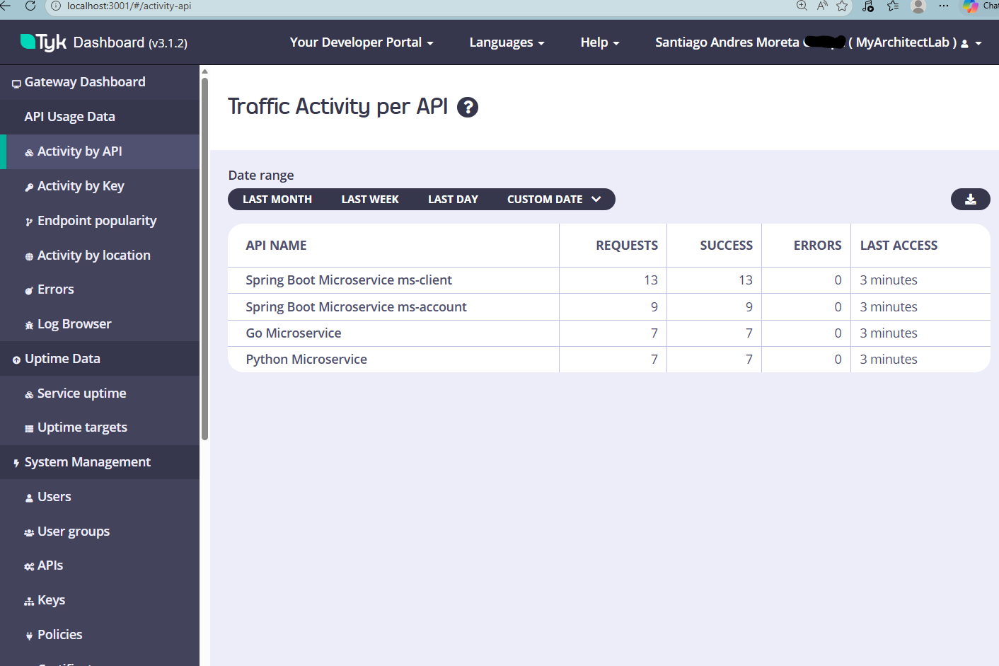

# 🏦 Financial Polyglot Platform & API Governance Lab

Este repositorio contiene una arquitectura de microservicios distribuida, políglota y de alta disponibilidad, diseñada para simular un ecosistema bancario moderno. El núcleo del sistema es la gobernanza, seguridad y observabilidad gestionada a través de **Tyk API Gateway**.


## 🏗️ Análisis Forense de la Arquitectura

El sistema opera bajo un modelo de **Plano de Control y Plano de Datos**, aislando completamente la lógica de negocio del tráfico externo.

### 1. Capa de Gobernanza (Tyk Stack)
* **Tyk Gateway (Data Plane):** Motor de alto rendimiento escrito en **Go**. Gestiona el ruteo L7, el stripping de paths y el proxy reverso hacia la red interna de Docker.
* **Tyk Dashboard (Control Plane):** Interfaz centralizada para la gestión del ciclo de vida de las APIs y la inyección de políticas de seguridad.
* **Tyk Pump (Data Pipeline):** Proceso asíncrono que extrae analíticas de **Redis** y las persiste en **MongoDB** para análisis histórico, garantizando que el Gateway se mantenga *stateless* y ultra rápido.

### 2. El "Zoo" de Microservicios (Polyglot Core)
Cada servicio fue elegido con un propósito arquitectónico específico:
* **Core Bancario (Java 17 + Spring Boot):** Dos microservicios (`ms-client` y `ms-account`) que implementan la lógica transaccional y de identidad mediante **Clean Architecture**.
* **High-Performance Edge (Go):** Servicio nativo para tareas de baja latencia y chequeos de salud del sistema (Latencia media: ~1.5ms).
* **IA & Scripting (Python Flask):** Capa flexible para prototipado rápido o procesamiento de datos (Latencia media: ~1.0ms).

### 3. Infraestructura de Persistencia
* **Redis (Hot Storage):** Almacenamiento en memoria para cuotas de rate-limiting, sesiones y caché de definiciones de API.
* **MongoDB (Analytics Store):** Base de datos documental para el almacenamiento masivo de logs y métricas de tráfico.

---

## 🛠️ Detalles del Despliegue (Docker Internals)

El despliegue utiliza **Docker Multi-stage builds** para optimizar el tamaño de las imágenes y la seguridad en producción.

### Red Interna y Seguridad
Todos los microservicios están encapsulados en una red privada virtual de Docker. **No exponen puertos al host**. 
* **Único punto de entrada:** `Tyk Gateway :8080`.
* **Aislamiento:** Un atacante no puede acceder directamente a los servicios de Java o Python; debe pasar por la gobernanza de Tyk.

```bash
# Levantar el ecosistema completo
docker-compose up -d --build
```

## Accesos al sistema

| Nodo | HTTP Acceso | Status |
| :--- | :--- | :--- |
| **Next Orchestrator** | http://localhost:3000 | ✅ |
| **Tyk Dashboard** | http://localhost:3001 | ✅ |
| **Go Microservice** | http://localhost:8080/go-service/health | ✅ |
| **Python Service** | http://localhost:8080/python-service/hello |✅ |
| **ms-account (Spring)** | http://localhost:8080/spring-service-account/health | ✅ |
| **ms-client (Spring)** | http://localhost:8080/spring-service-client/health | ✅ |

---

Aquí puedes ver el dashboard:



## 📊 Observabilidad y Métricas Reales
Basado en las últimas pruebas de carga en el laboratorio, estos son los rendimientos observados a través del Gateway:


| API Service | Runtime | Latencia Media | Status |
| :--- | :--- | :--- | :--- |
| **Go Microservice** | Native Bin | **1.5 ms** | ✅ |
| **Python Service** | Interpreted | **1.0 ms** | ✅ |
| **ms-account (Spring)** | JVM 17 | **25.7 ms** | ✅ |
| **ms-client (Spring)** | JVM 17 | **56.0 ms** | ✅ |

---

Puedes descargar la colección de Postman, al ser un proyecto legacy deberás actualizar los endpoints con los accesos correspondientes de **Accesos al sistema** que se encuentra en la sección anterior.

[Collection Bank](docs/collection_bank_postman.json)

## 🧪 Casos de Uso Implementados

### A. Registro de Clientes (Java)
Consumo de la API de identidad bancaria centralizada:
`GET /spring-service-client/api/clients` -> Redirigido internamente a `ms-client:8001`.

### B. Agregación de Servicios (Next.js)
El frontend consume simultáneamente datos de los tres lenguajes, demostrando que el Gateway abstrae completamente la complejidad tecnológica del backend.

---

## 🚧 Deuda Técnica & Roadmap (Production Ready)

Para escalar este laboratorio a una infraestructura de producción real (Fintech Grade), se identifican los siguientes puntos:

1.  **Seguridad (Zero Trust):** Implementar mTLS entre el Gateway y los microservicios, además de cambiar de *Keyless* a **JWT/OAuth2**.
2.  **Mensajería (Asíncrona):** Sustituir las llamadas REST internas entre `ms-client` y `ms-account` por un broker de eventos (**Apache Kafka**).
3.  **Observabilidad Avanzada:** Integrar un stack de **Prometheus + Grafana** para monitorear las "vísceras" de la JVM y el consumo de recursos de los contenedores.
4.  **Resiliencia:** Implementar el patrón **Circuit Breaker** (Resilience4j) para evitar fallos en cascada si un servicio legacy se degrada.
5.  **Service Mesh:** Evaluar la migración a Istio/Linkerd si la cantidad de microservicios crece exponencialmente.

---
**Architect:** Santiago Andres Moreta   
**Status:** Laboratory Concept - Fully Operational.
